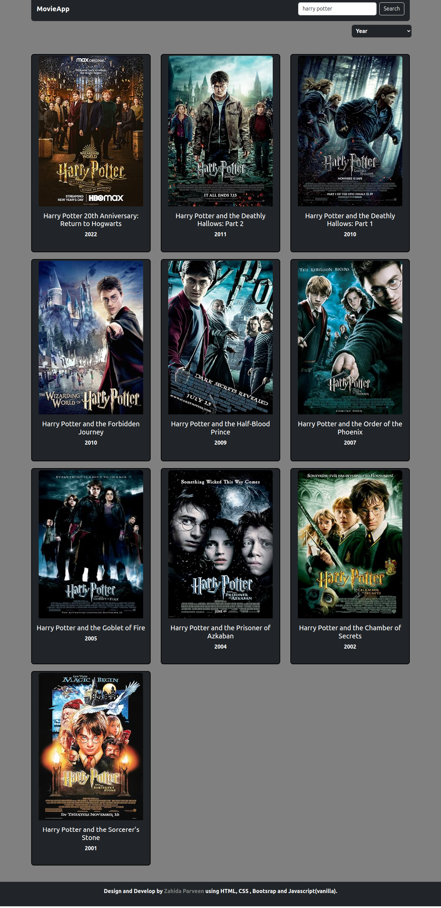

# 🎬 Movie Search Web App

A fully responsive and interactive movie search web application built using **HTML, CSS, JavaScript**, and the **OMDb API**. It allows users to search movies, view detailed information in a modal, and filter results by rating, year, or popularity.

---

## 🚀 Features

- 🔍 Search movies using the **OMDb API**
- 🎞️ View movie details in a **Bootstrap modal**
- 📊 Filter movies by **Year**, **Rating**, or **Popularity**
- 📱 Fully **responsive layout** (works on mobile, tablet, and desktop)
- 🖼️ Displays a default image if movie poster is missing

---

## 🎥 Live Demo

Click the image below to watch a short demo of the project in action:

---

## 🖼️ Screenshots

### 💻 Desktop View

> This project is fully responsive and adapts to all screen sizes.

---

## 🛠️ Tech Stack

- **Frontend**: HTML, CSS, JavaScript (Vanilla)
- **UI Framework**: Bootstrap 5.3
- **API**: [OMDb API](http://www.omdbapi.com/)
- **Icons**: Bootstrap Icons ( modals)

---

## 🧠 How It Works

1. On page load, the app shows random movie suggestions.
2. The user can type a keyword to search for movies.
3. Clicking any movie opens a Bootstrap modal with full details (title, poster, genre, actors, plot, and IMDB rating).
4. A dropdown allows sorting the results based on year, rating, or popularity.

---

## 📜 License

This project is licensed under the [MIT License](LICENSE).

---

## 🙋‍♀️ Created By

**Zahida Parveen**  
🔗 [GitHub Profile](https://github.com/RaiZahida)

---

## 🤝 Contributing

Pull requests are welcome! If you'd like to improve or extend this project, feel free to fork and contribute.

